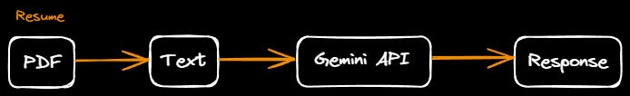

# ATS AI Resume Enhancer

## Demo
Try it out at this [link](https://ati-ai-resume-enhancer.streamlit.app/).

[Watch the Demo Video](./video/ATS%20AI%20Resume%20Enhancer.mov)
## Project Overview

This project leverages the [Gemini API](https://gemini.google.com/app) with the `gemini-1.5-flash` model and custom prompts to enhance resumes. Key features include generating insights such as:

- Resume Overview
- Keypoints in the Resume (e.g., strengths and weaknesses)
- Similarity Match Analysis
- Fit for the Job Role
- Interview Tips
- Job Market Insights
- Skills Gap Analysis

These functionalities aim to provide a comprehensive assessment of resumes, offering valuable feedback for both job seekers and recruiters.


---


## Project Structure

```bash
.
├── src/                  # Source code for streamlit pages, model inferencing, utils
├── app.py                # Streamlit run
├── README.md             # Project documentation
└── requirements.txt      # List of project dependencies
```

## Installation

To run this project, ensure you have **Python 3.10** or higher installed on your machine. Follow the steps below to set up the environment and install the required dependencies:

1. **Clone the Repository:**
   Clone this repository to your local machine.
   ```bash
   git clone https://github.com/AhmadHammad21/ATS-System.git
   ```
2. **Create a Virtual Environment:**
   Create and activate virtual environment.
   ```bash
   python3 -m venv env

   .\env\Scripts\activate
   ```
3. **Install the dependancies File:**
   Install the dependancies list.
   ```bash 
   pip install -r requirements.txt
   ```
4. **Get an API key**
   get an api from [Makersuite](https://aistudio.google.com/apikey)
   make an .env file and set it as follow
   GOOGLE_API_KEY = "API_KEY"

## Next Steps

- **Enhance the Prompts:** Find better prompts and functionalities.
- **Play around Different Models** Play around different models and choose a better model
- **Modify the Resume** Modify the resume itself, this is a challenging step.
